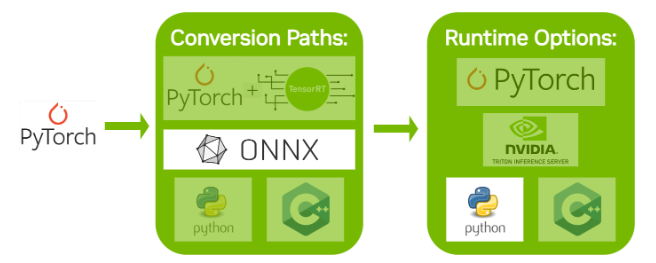

本文是 [The TensorRT Ecosystem](https://docs.nvidia.com/deeplearning/tensorrt/quick-start-guide/index.html#ecosystem) 的中文翻译。

## 1. TensorRT生态系统

TensorRT 是一个大型且灵活的项目。它可以处理各种转换和部署工作流，哪种工作流最适合您取决于您的具体用例和问题设置。

TensorRT 提供了多种部署选项，但所有工作流程都涉及将模型转换为优化的表示形式，TensorRT 将其称为引擎。为您的模型构建 TensorRT 工作流涉及选择正确的部署选项和正确的参数组合来创建引擎。

### 1.1 TensorRT工作流程

您必须遵循 5 个基本步骤来转换和部署模型：
1. 导出模型
2. 选择精度
3. 转换模型
4. 部署模型

在完整的端到端工作流上下文中理解这些步骤是最容易的：在[使用 ONNX 的示例部署](https://docs.nvidia.com/deeplearning/tensorrt/quick-start-guide/index.html#ex-deploy-onnx) 中，我们将介绍一个简单的与框架无关的部署工作流，以使用 ONNX 转换和 TensorRT 的独立运行时将经过训练的 ResNet-50 模型转换并部署到 TensorRT。

### 1.2 转换和部署选项

TensorRT 生态系统分为两部分：

1. 您可以按照各种路径将他们的模型转换为优化的 TensorRT 引擎。

2. 用户在部署其优化的 TensorRT 引擎时可以使用 TensorRT 定位的各种运行时。


#### 1.2.1 转换

使用 TensorRT 转换模型有三个主要选项：

- 使用 Torch-TensorRT
- 从文件自动 .onnx 转换 ONNX
- 使用 TensorRT API （在 C++ 或 Python 中）手动构建网络

PyTorch 集成 （Torch-TensorRT） 提供模型转换和用于转换 PyTorch 模型的高级运行时 API。它可以回退到 TensorRT 不支持特定运算符的 PyTorch 实现。有关支持的运算符的更多信息，请参阅 [ONNX 运算符支持](https://docs.nvidia.com/deeplearning/tensorrt/support-matrix/index.html#supported-ops) 。

自动模型转换和部署的更高性能选项是使用 ONNX 进行转换。ONNX 是一个与框架无关的选项，适用于 TensorFlow、PyTorch 等中的模型。TensorRT 支持使用 TensorRT API 或 `trtexec` ，从ONNX 文件自动转换，我们将在本指南中使用。ONNX 转换是全有或全无的，这意味着模型中的所有操作都必须受 TensorRT 支持（或者您必须为不支持的操作提供自定义插件）。ONNX 转换的结果是一个单一的 TensorRT 引擎，与使用 Torch-TensorRT 相比，它的开销更少。

为了获得尽可能高的性能和可自定义性，您可以手动构造 使用 TensorRT 网络定义 API 的 TensorRT 引擎。这主要涉及 在 TensorRT 中逐个操作构建与目标模型相同的网络， 仅使用 TensorRT 操作。创建 TensorRT 网络后，您将导出 只是框架中模型的权重，然后将它们加载到 TensorRT 中 网络。对于此方法，有关使用 TensorRT 的网络定义 API 可以在这里找到：

- [使用 C++ API 从头开始创建网络定义](https://docs.nvidia.com/deeplearning/tensorrt/developer-guide/index.html#create_network_c) 
- [使用 Python API 从头开始创建网络定义](https://docs.nvidia.com/deeplearning/tensorrt/developer-guide/#create_network_python) 

#### 1.2.2 部署

使用 TensorRT 部署模型有三种选择：

- 在 PyTorch 中部署
- 使用独立的 TensorRT 运行时 API
- 使用 NVIDIA Triton 推理服务器

使用 Torch-TensorRT 时，最常见的部署选项就是在 PyTorch 中部署。Torch-TensorRT 转换会生成一个 PyTorch 图，其中插入了 TensorRT 操作。这意味着您可以像使用 Python 运行任何其他 PyTorch 模型一样运行 Torch-TensorRT 模型。

TensorRT 运行时 API 可实现最低的开销和最精细的控制。但是，TensorRT 本身不支持的运算符必须作为插件实现（ [此处](https://github.com/NVIDIA/TensorRT/tree/main/plugin) 提供了预编写的插件库）。使用运行时 API 进行部署的最常见路径是使用框架的 ONNX 导出，本指南将在下一节中介绍。

最后， NVIDIA Triton 推理服务器是一款开源推理服务软件，使团队能够在任何基于 GPU 或 CPU 的基础设施（云、数据中心或边缘）上从任何框架（TensorFlow、TensorRT、PyTorch、ONNX 运行时或自定义框架）、本地存储或 Google Cloud Platform 或 AWS S3 部署经过训练的 AI 模型。这是一个灵活的项目，具有几个独特的功能，例如异构模型的并发模型执行和同一模型的多个副本（多个模型副本可以进一步减少延迟）以及负载平衡和模型分析。如果您必须通过 HTTP 提供模型（例如在云推理解决方案中），则这是一个不错的选择。您可以在 [此处](https://github.com/triton-inference-server/server/blob/r22.01/README.md#documentation) 找到 [NVIDIA Triton 推理服务器主页](https://developer.nvidia.com/nvidia-triton-inference-server) 和文档。

### 1.3 选择正确的工作流程

选择如何转换和部署模型时，两个最重要的因素是：

1. 您选择的框架。
2. 您首选的 TensorRT 运行时作为目标。

有关可用运行时选项的更多信息，请参阅 [本指南中包含的 Jupyter 笔记本 了解 TensorRT 运行时](https://github.com/NVIDIA/TensorRT/tree/main/quickstart/IntroNotebooks/5.%20Understanding%20TensorRT%20Runtimes.ipynb) 。

## 2. 使用 ONNX 的部署示例

[ONNX](https://github.com/onnx/onnx/blob/main/docs/IR.md) 是一种与框架无关的模型格式，可以从大多数主要框架（包括 TensorFlow 和 PyTorch）导出。TensorRT 提供了一个库，用于通过 [ONNX-TRT 解析器](https://github.com/onnx/onnx-tensorrt) 直接将 ONNX 转换为 TensorRT 引擎。

本节将介绍将预训练的 ResNet-50 模型从 ONNX 模型动物园转换为 TensorRT 引擎的五个步骤。从视觉上看，这是我们将遵循的过程：

在了解 TensorRT 工作流的基本步骤后，您可以深入了解更深入的 Jupyter 笔记本（请参阅以下主题），了解如何通过 Torch-TensorRT 或 ONNX 使用 TensorRT 。使用 PyTorch 框架，您可以按照 [此处](https://github.com/NVIDIA/TensorRT/tree/main/quickstart/IntroNotebooks/0.%20Running%20This%20Guide.ipynb) 的介绍性 Jupyter Notebook 进行操作，其中更详细地介绍了这些工作流步骤。


### 2.1 导出模型

TensorRT 转换的主要自动路径需要不同的模型格式才能成功转换模型： ONNX 路径要求将模型保存在 ONNX 中。

我们在本示例中使用 ONNX，因此我们需要一个 ONNX 模型。我们将使用 ResNet-50，这是一种可用于各种目的的基本骨干视觉模型。我们将使用 [ONNX 模型库](https://github.com/onnx/models) 中包含的预训练 ResNet-50 ONNX 模型执行分类。

使用以下命令从 ONNX 模型库下载预训练的 ResNet-50 模型 wget 并解压 它。

```bash
wget https://download.onnxruntime.ai/onnx/models/resnet50.tar.gz
tar xzf resnet50.tar.gz
```

这将解压预训练的 ResNet-50 `.onnx` 文件到路径 `resnet50/model.onnx` 。

您可以在 [从 PyTorch 导出到 ONNX](https://docs.nvidia.com/deeplearning/tensorrt/quick-start-guide/index.html#export-from-pytorch) 中了解我们如何导出适用于相同部署工作流程的 ONNX 模型。

### 2.2 选择精度

推理通常需要比训练更低的数值精度。如果小心的话，较低的精度可以为您提供更快的计算速度和更低的内存消耗，而不会牺牲任何有意义的精度。 TensorRT 支持 FP32、FP16、FP8、BF16、FP8、INT64、INT32、INT8 和 INT4 精度。

TensorRT 有两种类型的系统：

- 弱类型允许 TensorRT 的优化器自由地降低精度以提高性能。

- 强类型要求 TensorRT 根据输入的类型静态推断网络中每个张量的类型，然后严格遵守这些类型，如果您在导出之前已经降低了精度，并且希望 TensorRT 符合要求，那么这非常有用。

有关更多信息，请参阅 [强类型与弱类型](https://docs.nvidia.com/deeplearning/tensorrt/developer-guide/index.html#strong-vs-weak-typing) 。

本指南演示了弱类型网络的使用。

FP32是大多数框架的默认训练精度，因此我们将从使用FP32开始 供推论 这里。

```python
import numpy as np

PRECISION = np.float32
```

我们设置 TensorRT 引擎在运行时应使用的精度，我们将在下一节中执行此操作。

### 2.3 转换模型

ONNX 转换路径是自动 TensorRT 转换最通用、性能最高的路径之一。它适用于 TensorFlow、PyTorch 和许多其他框架。

有多种工具可帮助您将模型从 ONNX 转换为 TensorRT 引擎。一种常见的方法是使用 `trtexec` - TensorRT 附带的命令行工具，除其他外，可以将 ONNX 模型转换为 TensorRT 引擎并对其进行分析。

我们可以将这个转换运行为 如下：

```bash
trtexec --onnx=resnet50/model.onnx --saveEngine=resnet_engine_intro.engine

# 告诉 trtexec 在哪里可以找到我们的 ONNX 模型
#--onnx=resnet50/model.onnx

# 告诉 trtexec 将引擎保存到哪里
#--saveEngine=resnet_engine_intro.engine
```

### 2.4 部署模型

成功创建 TensorRT 引擎后，我们必须决定如何使用 TensorRT 运行它。

TensorRT 运行时有两种类型：具有 C++ 和 Python 绑定的独立运行时，以及与 PyTorch 的本机集成。在本节中，我们将使用一个简化的包装器（ `ONNXClassifierWrapper` ） 调用独立运行时。我们将生成一批随机“虚拟”数据并使用我们的 `ONNXClassifierWrapper` 对该批次运行推理。有关 TensorRT 运行时的更多信息，请参阅 [了解 TensorRT 运行时Jupyter](https://github.com/NVIDIA/TensorRT/tree/main/quickstart/IntroNotebooks/5.%20Understanding%20TensorRT%20Runtimes.ipynb) 笔记本。

1. 设置 `ONNXClassifierWrapper` （使用我们的精度 在[选择精度](2.2 选择精度) 中确定）。

```python
from onnx_helper import ONNXClassifierWrapper
trt_model = ONNXClassifierWrapper("resnet_engine.trt", target_dtype = PRECISION)
```

2. 生成虚拟批次。

```python
input_shape = (1, 3, 224, 224)
dummy_input_batch = np.zeros(input_shape , dtype = PRECISION)
```

3. 将一批数据输入我们的引擎并得到我们的 预测。

```python
predictions = trt_model.predict(dummy_input_batch)
```

请注意，包装器在运行第一批之前不会加载并初始化引擎，因此该批通常需要一段时间。有关批处理的更多信息，请参阅 [批处理](https://docs.nvidia.com/deeplearning/tensorrt/developer-guide/index.html#batching) 。

有关 TensorRT API 的更多信息，请参阅 [NVIDIA TensorRT API 文档](https://docs.nvidia.com/deeplearning/tensorrt/index.html) 。欲了解更多信息 `ONNXClassifierWrapper` ，请在 [此处](https://github.com/NVIDIA/TensorRT/blob/HEAD/quickstart/IntroNotebooks/onnx_helper.py) 查看其在 GitHub 上的实现。

## 3. ONNX转换和部署

ONNX 交换格式提供了一种从许多框架（包括 PyTorch、TensorFlow 和 TensorFlow 2）导出模型的方法，以便与 TensorRT 运行时一起使用。使用 ONNX 导入模型需要 ONNX 支持模型中的运算符，并且您需要提供 TensorRT 不支持的任何运算符的插件实现。 （可以在 [此处](https://github.com/NVIDIA/TensorRT/tree/main/plugin) 找到 TensorRT 插件库）。

### 3.1 使用 ONNX 转换

可以使用 PyTorch [导出](https://pytorch.org/tutorials/beginner/onnx/export_simple_model_to_onnx_tutorial.html) 从 PyTorch 模型轻松生成 ONNX 模型。

[本笔记本](https://github.com/NVIDIA/TensorRT/blob/HEAD/quickstart/IntroNotebooks/2.%20Using%20PyTorch%20through%20ONNX.ipynb) 展示了如何从 PyTorch ResNet-50 模型生成 ONNX 模型，如何使用这些 ONNX 模型转换为 TensorRT 引擎 `trtexec` ，以及如何使用 TensorRT 运行时在推理时向 TensorRT 引擎提供输入。

#### 3.1.1 从 PyTorch 导出到 ONNX

将 PyTorch 模型转换为 TensorRT 的一种方法是将 PyTorch 模型导出到 ONNX，然后将其转换为 TensorRT 引擎。有关更多详细信息，请参阅 [通过 ONNX 将 PyTorch 与 TensorRT 结合使用](https://github.com/NVIDIA/TensorRT/blob/HEAD/quickstart/IntroNotebooks/2.%20Using%20PyTorch%20through%20ONNX.ipynb) 。笔记本将引导您完成此路径，从以下导出步骤开始：



1. 从以下位置导入 ResNet-50 模型 `torchvision` 。这将加载带有预训练权重的 ResNet-50 副本。

```python
import torchvision.models as models
resnet50 = models.resnet50(pretrained=True,progress=False).eval()
```

2. 从 PyTorch 保存 ONNX 文件。

> 注意：我们需要一批数据来从 PyTorch 保存 ONNX 文件。我们将使用虚拟批次。

```python
import torch

BATCH_SIZE = 32
dummy_input=torch.randn(BATCH_SIZE, 3, 224, 224)
```

3. 保存 ONNX 文件。

```python
import torch.onnx
torch.onnx.export(resnet50, dummy_input, "resnet50_pytorch.onnx", verbose=False)
```

### 3.2 将 ONNX 转换为 TensorRT 引擎

将 ONNX 文件转换为 TensorRT 引擎的主要方法有两种：

1. 使用 `trtexec` 命令行工具。
2. 使用 TensorRT API。

在本指南中，我们将重点介绍如何使用 `trtexec` 。要转换其中之一 使用之前的 ONNX 模型到 TensorRT 引擎 `trtexec` ，我们可以运行 这个转换为 如下：

```bash
trtexec --onnx=resnet50_pytorch.onnx --saveEngine=resnet_engine_pytorch.trt
```

这将转换我们的 `resnet50_onnx_model.onnx` 到一个名为的 TensorRT 引擎 `resnet_engine.trt` 。

### 3.3 将 TensorRT 引擎部署到 Python 运行时 API

有多个运行时可用于 TensorRT 的目标。当性能很重要时，TensorRT API 是运行 ONNX 模型的好方法。我们将在下一节中使用 C++ 和 Python 中的 TensorRT 运行时 API 来部署更复杂的 ONNX 模型。

对于上述模型，您可以在笔记本 [使用 PyTorch through ONNX](https://github.com/NVIDIA/TensorRT/blob/HEAD/quickstart/IntroNotebooks/2.%20Using%20PyTorch%20through%20ONNX.ipynb) 中了解如何使用 Python 运行时 API 将其部署在 Jupyter 中。另一个简单的选择是使用 `ONNXClassifierWrapper` 随本指南一起提供，如 [部署模型](https://docs.nvidia.com/deeplearning/tensorrt/quick-start-guide/index.html#deploy-engine) 中所示。

## 4. 使用TensorRT运行时API

对于模型转换和部署来说，性能最高、可定制的选项之一是使用 TensorRT API，它同时具有 C++ 和 Python 绑定。

TensorRT 包括带有 C++ 和 Python 绑定的独立运行时，通常比使用 TF-TRT 集成和在 TensorFlow 中运行具有更高的性能和更可定制性。 C++ API 的开销较低，但 Python API 与 Python 数据加载器和 NumPy 和 SciPy 等库配合良好，并且更易于用于原型设计、调试和测试。

以下教程说明了使用 TensorRT C++ 和 Python API 进行图像语义分割。此任务使用具有 ResNet-101 主干的全卷积模型。该模型接受任意大小的图像并生成每像素预测。

本教程包含以下步骤：

1. 设置 - 启动测试容器，并从导出到 ONNX 并使用转换的 PyTorch 模型生成 TensorRT 引擎 `trtexec`
2. C++ 运行时 API – 使用引擎和 TensorRT 的 C++ API 运行推理
3. Python 运行时 AP – 使用引擎和 TensorRT 的 Python API 运行推理

### 4.1 设置测试容器并构建 TensorRT 引擎

1. 从 [TensorRT 开源软件存储库](http://github.com/NVIDIA/TensorRT) 下载本快速入门教程的源代码。

```bash
$ git clone https://github.com/NVIDIA/TensorRT.git
$ cd TensorRT/quickstart
```

2. 将预训练的 [FCN-ResNet-101](https://pytorch.org/hub/pytorch_vision_fcn_resnet101/) 模型转换为 ONNX。

这里我们使用教程中包含的导出脚本来生成 ONNX 模型并将其保存到 `fcn-resnet101.onnx` 。有关 ONNX 转换的详细信息，请参阅 [ONNX 转换和部署](https://docs.nvidia.com/deeplearning/tensorrt/quick-start-guide/index.html#onnx-export) 。该脚本还生成大小为 1282x1026 的 [测试图像](https://pytorch.org/assets/images/deeplab1.png) 并将其保存到 `input.ppm` 。


a. 启动 NVIDIA PyTorch 容器以运行导出脚本。

```bash
$ docker run --rm -it --gpus all -p 8888:8888 -v `pwd`:/workspace -w /workspace/SemanticSegmentation nvcr.io/nvidia/pytorch:20.12-py3 bash
```

b. 运行导出脚本将预训练模型转换为 ONNX。

```bash
$ python3 export.py
```

> 注意： FCN-ResNet-101 有一个维度的输入 `[batch, 3, height, width]` 和一个维度的输出 `[batch, 21, height, weight]` 包含与 21 个类标签的预测相对应的非标准化概率。将模型导出到 ONNX 时，我们附加一个 `argmax` 输出层产生最高概率的每像素类标签。

3. 使用 ONNX 构建 TensorRT 引擎 trtexec 工具。

`trtexec` 可以从 ONNX 模型生成 TensorRT 引擎，然后可以使用 TensorRT 运行时 API 进行部署。它利用 [TensorRT ONNX 解析器](https://github.com/onnx/onnx-tensorrt) 将 ONNX 模型加载到 TensorRT 网络图中，并利用 TensorRT [Builder API](https://docs.nvidia.com/deeplearning/tensorrt/developer-guide/index.html#build_engine_c) 生成优化的引擎。构建引擎可能非常耗时，并且通常是离线执行的。

构建引擎可能非常耗时，并且通常需要执行 离线。

```bash
trtexec --onnx=fcn-resnet101.onnx --saveEngine=fcn-resnet101.engine --optShapes=input:1x3x1026x1282
```

成功执行应该会生成一个引擎文件以及类似的内容 `Successful` 在命令输出中。

`trtexec` 可以使用 [NVIDIA TensorRT 开发人员指南](https://docs.nvidia.com/deeplearning/tensorrt/developer-guide/index.html#trtexec-flags) 中所述的构建配置选项构建 TensorRT 引擎。

### 4.2 用 C++ 运行引擎

在测试中编译并运行 C++ 分段教程 容器。

```bash
$ make
$ ./bin/segmentation_tutorial
```


以下步骤展示了如何使用 [Deserializing A Plan](https://docs.nvidia.com/deeplearning/tensorrt/developer-guide/index.html#perform_inference_c) 进行推理。

1. 从文件反序列化 TensorRT 引擎。文件内容被读入缓冲区并在内存中反序列化。

```cpp
std::vector<char> engineData(fsize);
engineFile.read(engineData.data(), fsize);

std::unique_ptr<nvinfer1::IRuntime> mRuntime{nvinfer1::createInferRuntime(sample::gLogger.getTRTLogger())};

std::unique_ptr<nvinfer1::ICudaEngine> mEngine(runtime->deserializeCudaEngine(engineData.data(), fsize));
```

2. TensorRT 执行上下文封装了执行状态，例如用于在推理期间保存中间激活张量的持久设备内存。

由于分割模型是在启用动态形状的情况下构建的，因此必须指定输入的形状以进行推理执行。可以查询网络输出形状以确定输出缓冲器的相应尺寸。

```cpp
char const* input_name = "input";
assert(mEngine->getTensorDataType(input_name) == nvinfer1::DataType::kFLOAT);
auto input_dims = nvinfer1::Dims4{1, /* channels */ 3, height, width};
context->setInputShape(input_name, input_dims);
auto input_size = util::getMemorySize(input_dims, sizeof(float));
char const* output_name = "output";
assert(mEngine->getTensorDataType(output_name) == nvinfer1::DataType::kINT64);
auto output_dims = context->getTensorShape(output_name);
auto output_size = util::getMemorySize(output_dims, sizeof(int64_t));
```

3. 在准备推理时，为所有输入和输出分配 CUDA 设备内存，处理图像数据并将其复制到输入内存中，并生成引擎绑定列表。

对于语义分割，输入图像数据通过拟合到一系列 `[0, 1]` 并使用均值标准化 `[0.485, 0.456, 0.406]` 和 `std` 偏差 `[0.229, 0.224, 0.225]` 。请参阅输入预处理要求 `torchvision` 模型 [在这里](https://github.com/pytorch/vision/blob/main/docs/source/models.rst) 。该操作由实用程序类抽象 `RGBImageReader` 。

```cpp
void* input_mem{nullptr};
cudaMalloc(&input_mem, input_size);
void* output_mem{nullptr};
cudaMalloc(&output_mem, output_size); 
const std::vector<float> mean{0.485f, 0.456f, 0.406f};
const std::vector<float> stddev{0.229f, 0.224f, 0.225f};
auto input_image{util::RGBImageReader(input_filename, input_dims, mean, stddev)};
input_image.read();
cudaStream_t stream;
auto input_buffer = input_image.process();
cudaMemcpyAsync(input_mem, input_buffer.get(), input_size, cudaMemcpyHostToDevice, stream);
```

4. 推理执行是使用上下文启动的 `executeV2` 或者 `enqueueV3` 方法。执行完成后，我们将结果复制回主机缓冲区并释放所有设备内存分配。

```cpp
context->setTensorAddress(input_name, input_mem);
context->setTensorAddress(output_name, output_mem);
bool status = context->enqueueV3(stream);
auto output_buffer = std::unique_ptr<int64_t>{new int64_t[output_size]};
cudaMemcpyAsync(output_buffer.get(), output_mem, output_size, cudaMemcpyDeviceToHost, stream);
cudaStreamSynchronize(stream);

cudaFree(input_mem);
cudaFree(output_mem);
```

5. 为了可视化结果，将每像素类预测的伪彩色图写入 `output.ppm` 。这是由实用程序类抽象的 `ArgmaxImageWriter` 。

```cpp
const int num_classes{21};
const std::vector<int> palette{
	(0x1 << 25) - 1, (0x1 << 15) - 1, (0x1 << 21) - 1};
auto output_image{util::ArgmaxImageWriter(output_filename, output_dims, palette, num_classes)};
int64_t* output_ptr = output_buffer.get();
std::vector<int32_t> output_buffer_casted(output_size);
for (size_t i = 0; i < output_size; ++i) {
    output_buffer_casted[i] = static_cast<int32_t>(output_ptr[i]);
}
output_image.process(output_buffer_casted.get());
output_image.write();
```

### 4.3 在 Python 中运行引擎

1. 安装所需的Python 包。

```bash
$ pip install pycuda
```

2. 启动 Jupyter 并使用提供的令牌通过浏览器登录 `http://<host-ip-address>:8888` .

```bash
$ jupyter notebook --port=8888 --no-browser --ip=0.0.0.0 --allow-root
```

3. 打开 [tutorial-runtime.ipynb](https://github.com/NVIDIA/TensorRT/blob/main/quickstart/SemanticSegmentation/tutorial-runtime.ipynb) 笔记本并按照其步骤进行操作。

TensorRT Python 运行时 API 直接映射到在 [C++ 中运行引擎](https://docs.nvidia.com/deeplearning/tensorrt/quick-start-guide/index.html#run-engine-c) 中描述的 C++ API。

## 5. 词汇表

B
Batch 批
A batch is a collection of inputs that can all be processed uniformly. Each instance in the batch has the same shape and flows through the network in exactly the same way. All instances can therefore be computed in parallel.
批次是可以统一处理的输入的集合。批次中的每个实例都具有相同的形状，并以完全相同的方式流经网络。因此，所有实例都可以并行计算。
Builder 建设者
TensorRT’s model optimizer. The builder takes as input a network definition, performs device-independent and device-specific optimizations, and creates an engine. For more information about the builder, refer to the Builder API.
TensorRT 的模型优化器。构建器将网络定义作为输入，执行独立于设备和特定于设备的优化，并创建引擎。有关构建器的更多信息，请参阅构建器 API 。
D
Dynamic batch 动态批次
A mode of inference deployment where the batch size is not known until runtime. Historically, TensorRT treated batch size as a special dimension and the only dimension that was configurable at runtime. TensorRT 6 and later allow engines to be built such that all dimensions of inputs can be adjusted at runtime.
一种推理部署模式，其中批量大小直到运行时才知道。从历史上看，TensorRT 将批量大小视为特殊维度，并且是运行时唯一可配置的维度。 TensorRT 6 及更高版本允许构建引擎，以便可以在运行时调整输入的所有维度。
E
Engine 引擎
A representation of a model that has been optimized by the TensorRT builder. For more information about the engine, refer to the Execution API.
已由 TensorRT 构建器优化的模型的表示。有关引擎的更多信息，请参阅执行 API 。
Explicit batch 显式批处理
An indication to the TensorRT builder that the model includes the batch size as one of the dimensions of the input tensors. TensorRT’s implicit batch mode allows the batch size to be omitted from the network definition and provided by the user at runtime, but this mode has been deprecated and is not supported by the ONNX parser.
向 TensorRT 构建器指示模型将批量大小作为输入张量的维度之一。 TensorRT 的隐式批处理模式允许从网络定义中省略批处理大小并由用户在运行时提供，但此模式已被弃用，并且 ONNX 解析器不支持。
F
Framework integration 框架整合
An integration of TensorRT into a framework such as TensorFlow, which allows model optimization and inference to be performed within the framework.
将 TensorRT 集成到 TensorFlow 等框架中，允许在框架内执行模型优化和推理。
N
Network definition 网络定义
A representation of a model in TensorRT. A network definition is a graph of tensors and operators.
TensorRT 中模型的表示。网络定义是张量和运算符的图。
O
ONNX 奥恩克斯
Open Neural Network eXchange. A framework-independent standard for representing machine learning models. For more information about ONNX, refer to onnx.ai.
打开神经网络交换。用于表示机器学习模型的独立于框架的标准。有关 ONNX 的更多信息，请参阅onnx.ai 。
ONNX parser ONNX 解析器
A parser for creating a TensorRT network definition from an ONNX model. For more details on the C++ ONNX Parser, refer to the NvONNXParser or the Python ONNX Parser.
用于从 ONNX 模型创建 TensorRT 网络定义的解析器。有关 C++ ONNX 解析器的更多详细信息，请参阅NvONNXParser或 Python ONNX 解析器。
P
Plan 计划
An optimized inference engine in a serialized format. To initialize the inference engine, the application will first deserialize the model from the plan file. A typical application will build an engine once, and then serialize it as a plan file for later use.
序列化格式的优化推理引擎。为了初始化推理引擎，应用程序将首先从计划文件中反序列化模型。典型的应用程序将构建一次引擎，然后将其序列化为计划文件以供以后使用。
Precision 精确
Refers to the numerical format used to represent values in a computational method. This option is specified as part of the TensorRT build step. TensorRT supports mixed precision inference with FP32, TF32, FP16, or INT8 precisions. Devices before NVIDIA Ampere Architecture default to FP32. NVIDIA Ampere Architecture and later devices default to TF32, a fast format using FP32 storage with lower-precision math.
指计算方法中用于表示值的数字格式。此选项被指定为 TensorRT 构建步骤的一部分。 TensorRT 支持 FP32、TF32、FP16 或 INT8 精度的混合精度推理。 NVIDIA Ampere 架构之前的设备默认为 FP32。 NVIDIA Ampere 架构和更高版本的设备默认使用 TF32，这是一种使用具有较低精度数学的 FP32 存储的快速格式。
R
Runtime 运行时
The component of TensorRT that performs inference on a TensorRT engine. The runtime API supports synchronous and asynchronous execution, profiling, enumeration, and querying of the bindings for engine inputs and outputs.
在 TensorRT 引擎上执行推理的 TensorRT 组件。运行时 API 支持引擎输入和输出的绑定的同步和异步执行、分析、枚举和查询。
T
TF-TRT
TensorFlow integration with TensorRT. Optimizes and executes compatible subgraphs, allowing TensorFlow to execute the remaining graph.
TensorFlow 与 TensorRT 集成。优化并执行兼容的子图，允许 TensorFlow 执行剩余的图。

## 6. F&Q

- Q: Error (Could not find any implementation for node ArgMax_260.)

A: To fix this problem just add the workspace size with --workspace=4096 option. This because the workspace is not enough for tensorrt 8.X.
Here list a example of the changed cmd:
trtexec --onnx=fcn-resnet101.onnx --fp16 --workspace=4096 --minShapes=input:1x3x256x256 --optShapes=input:1x3x1026x1282 --maxShapes=input:1x3x1440x2560 --buildOnly --saveEngine=fcn-resnet101.engine
Thanks to jasxu-nvidia 3 's comments
reference from Quick Start, Unable to prepare engine · Issue #1965 · NVIDIA/TensorRT · GitHub 20
> 需要注意：tensorRT 10.5不支持 --workspace=4096 和 --buildOnly，这条命令是在容器中使用的。

- Q: FCN-ResNet-101 例子 Segmentation fault (core dumped)

A: 上文中的 nvidia-docker 使用的tensorRT版本是7.2.2.1，而我们使用的是10.5，尽管示例代码是基于10.5的。所以在构建engine和make项目时应使用本机的tensorRT版本，即10.5。最后在本机运行即可。